# Scrcpy Launcher (Rust) - AI 辅助开发指南

> 最后更新：2026-01-29 10:08:37
> 项目版本：v2.5.0
> 扫描覆盖率：约 90%（核心模块全覆盖，新增功能文档完善）

## 变更记录 (Changelog)

### 2026-01-29 (增量更新 v2.5.0)
- 补充新版本功能：智能应用补全优化、设置界面重构
- 新增模块：`docs/` 开发者指南目录
- 新增功能：自定义应用图标管理、智能联想仅搜名称开关
- 更新 Mermaid 结构图，添加可点击节点链接
- 完善模块级文档导航面包屑

### 2026-01-27
- 初始化 AI 上下文文档
- 完成项目架构扫描与模块识别
- 生成模块结构图与索引

---

## 项目愿景

Scrcpy Launcher 是一个基于 **Tauri 2.0 + Rust** 的跨平台桌面应用，为 Genymobile/scrcpy 提供图形化启动器和配置管理界面。

**核心价值**：
- 简化 Android 设备屏幕镜像和应用流转操作
- 提供直观的 ADB 无线连接管理
- 支持应用流转（在独立窗口运行 Android 应用）
- 局域网自动扫描设备
- 原生 ADB 协议实现，提供精准的文件传输进度反馈
- 智能应用管理：自动填充包名、自定义图标、智能排序联想

**技术特色**：
- 后端：Rust + Tauri 2.0，提供高性能和安全的本地应用
- 前端：Vanilla JavaScript（无框架依赖），轻量简洁
- 资源打包：内置 ADB 和 Scrcpy 可执行文件，开箱即用
- 智能数据库：内置常见应用包名数据库，支持模糊匹配

---

## 架构总览

### 技术栈

| 层级 | 技术选型 | 说明 |
|------|---------|------|
| **应用框架** | Tauri 2.0 | 跨平台桌面应用框架 |
| **后端语言** | Rust (Edition 2021) | 高性能系统编程 |
| **前端** | Vanilla JavaScript | 原生 JS，无框架依赖 |
| **UI 样式** | CSS3 | 自定义样式，支持深色/浅色主题 |
| **构建工具** | Cargo + Tauri CLI | Rust 包管理与构建 |
| **IPC 通信** | Tauri Commands | 前后端异步命令调用 |
| **核心依赖** | serde, tokio, anyhow, dirs, base64 | 序列化、异步运行时、错误处理、编码 |

### 架构模式

- **前后端分离**：前端通过 Tauri IPC 调用后端 Rust 命令
- **事件驱动**：前端监听后端事件（如文件传输进度）
- **配置持久化**：JSON 格式配置文件，支持热重载
- **单实例限制**：Windows 平台仅允许单实例运行
- **系统托盘**：最小化到托盘，提供快捷操作
- **智能补全**：应用数据库支持模糊匹配和排序优化

---

## 模块结构图

```mermaid
graph TD
    Root["(根) scrcpy-launcher-rust"] --> Src["src/ - Rust 后端"]
    Root --> Dist["dist/ - 前端源码"]
    Root --> Resources["resources/ - 资源文件"]
    Root --> Docs["docs/ - 开发文档"]
    Root --> Config["配置与构建"]

    Src --> Main["main.rs - 应用入口"]
    Src --> Lib["lib.rs - 库导出"]
    Src --> Commands["commands.rs - IPC 命令"]
    Src --> ConfigRs["config.rs - 配置管理"]
    Src --> ScrcpyRs["scrcpy.rs - 核心逻辑"]
    Src --> TrayRs["tray.rs - 系统托盘"]
    Src --> AdbSync["adb_sync.rs - ADB 传输"]

    Dist --> HTML["index.html - 主界面"]
    Dist --> MainJS["main.js - 前端逻辑"]
    Dist --> Styles["styles.css - 主样式"]
    Dist --> Suggestions["suggestions.css - 联想样式"]
    Dist --> AppDB["app_database.json - 应用数据库"]

    Resources --> Bin["bin/ - ADB/Scrcpy"]
    Resources --> Fonts["fonts/ - 字体文件"]

    Docs --> BackendGuide["backend_guide.md - 后端开发指南"]
    Docs --> FrontendGuide["frontend_guide.md - 前端开发指南"]

    Config --> Cargo["Cargo.toml - Rust 配置"]
    Config --> Build["build.rs - 构建脚本"]

    click Src "./src/CLAUDE.md" "查看后端模块文档"
    click Dist "./dist/CLAUDE.md" "查看前端模块文档"
    click Docs "./docs/" "查看开发者文档"
```



---

## 模块索引

| 路径 | 职责 | 语言 | 状态 | 文档 |
|------|------|------|------|------|
| **src/** | Rust 后端核心逻辑 | Rust | ✅ 完整 | [CLAUDE.md](./src/CLAUDE.md) |
| **dist/** | 前端界面（HTML/JS/CSS） | JavaScript | ✅ 完整 | [CLAUDE.md](./dist/CLAUDE.md) |
| **resources/** | 打包资源（ADB、Scrcpy、字体） | Binary | ⚠️ 二进制未读 | - |
| **docs/** | 开发者指南文档 | Markdown | ✅ 已读 | [目录](./docs/) |
| **根目录** | 配置文件、构建脚本 | TOML/Rust | ✅ 已读 | - |

### 详细说明

#### src/ - Rust 后端模块

**核心文件**：
- `main.rs` - 应用入口、窗口事件、单实例限制、33 个 IPC 命令注册
- `lib.rs` - 库导出声明（6 个模块）
- `commands.rs` - Tauri IPC 命令接口（33+ 命令），含自定义图标管理
- `config.rs` - 配置数据结构与管理，支持新增设置项
- `scrcpy.rs` - Scrcpy/ADB 核心逻辑（进程管理、网络扫描）
- `tray.rs` - 系统托盘实现
- `adb_sync.rs` - 原生 ADB SYNC 协议实现（文件传输）

**关键功能**：
- ADB 无线连接与配对
- 局域网设备扫描（支持多网卡、VPN 兼容）
- Scrcpy 进程启动与参数构建
- 文件拖拽传输与进度反馈
- 配置持久化与热加载
- **自定义应用图标**：支持用户自定义应用图标（Base64 编码存储）
- **智能应用补全**：根据名称自动匹配包名，支持排序优化

#### dist/ - 前端模块

**核心文件**：
- `index.html` - 主界面结构（ADB 连接、标签页、模态框）
- `main.js` - 前端逻辑（1400+ 行），含智能联想和图标管理
- `styles.css` - 主样式表
- `suggestions.css` - 自动补全建议列表样式
- `app_database.json` - 应用包名数据库（常见应用预配置）

**UI 结构**：
- ADB 连接区域（状态、IP 输入、历史记录、扫描）
- 工具箱（文件传输）
- 直接投屏标签页（镜像/音频启动）
- 应用流转标签页（应用卡片网格、智能补全输入框）
- 设置/高级设置模态框
- 系统托盘菜单
- **应用图标管理**：浏览、选择、删除自定义图标

**v2.5.0 新增功能**：
- 智能应用补全优化：完全匹配 > 开头匹配 > 包含匹配
- "仅搜名称" 开关：屏蔽包名搜索，只匹配应用名称
- 输入联想仅显示已安装应用选项移至全局设置
- 自定义应用图标功能

#### docs/ - 开发者文档

**文件**：
- `backend_guide.md` - 后端开发指南（已存在模块级文档）
- `frontend_guide.md` - 前端开发指南（已存在模块级文档）

**职责**：
- 提供开发入门指引
- 记录关键 API 使用方法
- 汇总常见问题与解决方案

---

## 运行与开发

### 环境要求

- **Rust**：stable 工具链（Edition 2021）
- **Node.js**：可选（如需前端构建）
- **系统**：主要支持 Windows，可扩展到 macOS/Linux

### 开发模式

```bash
# 1. 克隆仓库
git clone <repository-url>
cd scrcpy-launcher-rust

# 2. 安装依赖（Rust 自动处理）
cargo fetch

# 3. 开发运行（Tauri 热重载）
cargo tauri dev

# 4. 构建发布版本
cargo tauri build

# 5. 生成 API 文档
cargo doc --open
```

### 前端开发

前端文件位于 `dist/` 目录，直接编辑即可实时生效（开发模式下）。

**注意事项**：
- 前端使用 Vanilla JavaScript，无构建流程
- 修改 HTML/CSS/JS 后刷新页面即可看到效果
- 使用 Tauri DevTools（F12）调试

### 资源文件

- `resources/bin/` - ADB 和 Scrcpy 可执行文件（Windows 版本）
- `resources/fonts/` - MiSans 字体

**注意**：资源文件会被打包到最终应用中，开发模式下使用相对路径。

---

## 测试策略

### 当前状态

⚠️ **项目暂无自动化测试**

- 无单元测试文件（`*_test.rs`）
- 无集成测试（`tests/` 目录）
- 无前端测试框架

### 建议的测试改进

1. **Rust 单元测试**：
   - 为 `config.rs` 的配置序列化/反序列化添加测试
   - 为 `scrcpy.rs` 的参数构建逻辑添加测试
   - 为 `adb_sync.rs` 的协议解析添加测试
   - 为应用图标 Base64 编码/解码添加测试

2. **集成测试**：
   - 模拟 ADB 进程调用
   - 测试文件传输流程
   - 测试智能补全匹配算法

3. **前端测试**：
   - 使用 Jest 或 Vitest 测试关键 JS 函数
   - 测试应用数据库匹配逻辑
   - E2E 测试（Playwright）验证完整工作流

---

## 编码规范

### Rust 代码规范

- **Edition**：Rust 2021
- **风格**：遵循 `rustfmt` 默认配置
- **文档**：公共模块和函数应包含文档注释（`//!` 和 `///`）
- **错误处理**：使用 `anyhow` 进行错误传播，`Result<T, String>` 用于 IPC 返回

### JavaScript 代码规范

- **风格**：ES6+ 语法，函数式优先
- **命名**：驼峰命名（camelCase）
- **注释**：关键逻辑添加中文注释
- **异步**：使用 `async/await`，避免回调地狱

### 命名约定

- **Rust 结构体**：PascalCase（如 `GlobalSettings`）
- **Rust 函数**：snake_case（如 `check_adb_status`）
- **JavaScript 函数**：camelCase（如 `checkAdbStatus`）
- **文件名**：snake_case（如 `config.rs`, `main.js`）

---

## AI 使用指引

### 适合 AI 辅助的任务

1. **添加新功能**：
   - 新增 Tauri 命令（在 `commands.rs` 和 `main.rs` 注册）
   - 扩展配置结构（`config.rs`）
   - 添加前端 UI（`dist/`）

2. **修复 Bug**：
   - ADB 连接逻辑（`scrcpy.rs`）
   - 配置序列化问题（`config.rs`）
   - 前端交互逻辑（`main.js`）
   - 智能补全匹配算法（`main.js`）

3. **优化改进**：
   - 性能优化（异步任务、文件传输）
   - UI/UX 改进
   - 错误处理增强
   - 应用数据库扩展

### 关键约束

- **不修改资源文件**：`resources/bin/` 下的二进制文件不可修改
- **配置兼容性**：新增配置项需提供默认值，保持向后兼容
- **Tauri 命令注册**：新增命令必须在 `main.rs` 的 `invoke_handler!` 宏中注册
- **前后端同步**：前端调用命令时参数名必须与 Rust 命令定义一致
- **应用数据库**：修改 `app_database.json` 时需保持 JSON 格式正确

### 常见任务示例

#### 添加新的 Tauri 命令

1. 在 `commands.rs` 中定义函数：
```rust
#[tauri::command]
pub fn my_new_command(param: String) -> CommandResult {
    // 实现逻辑
    CommandResult {
        success: true,
        message: "操作成功".to_string(),
    }
}
```

2. 在 `main.rs` 中注册：
```rust
.invoke_handler(tauri::generate_handler![
    // ... 其他命令
    commands::my_new_command,  // 新增
])
```

3. 在前端调用（`main.js`）：
```javascript
const result = await invoke('my_new_command', { param: '值' });
```

#### 扩展配置结构

1. 在 `config.rs` 中添加字段：
```rust
#[derive(Serialize, Deserialize, Clone, Debug)]
pub struct Config {
    // ... 现有字段
    #[serde(default = "default_my_field")]
    pub my_new_field: String,
}

fn default_my_field() -> String {
    "默认值".to_string()
}
```

2. 更新 `Default` 实现

3. 前端可通过 `get_config()` 获取新字段

#### 添加应用数据库条目

在 `dist/app_database.json` 中添加：
```json
{
  "name": "应用名称",
  "package": "com.example.app",
  "icon": "可选：图标 URL 或 Base64"
}
```

---

## 相关文件清单

### 核心源码

```
src/
├── main.rs          # 应用入口（73 行）
├── lib.rs           # 库导出（8 行）
├── commands.rs      # IPC 命令（340+ 行）
├── config.rs        # 配置管理（280+ 行）
├── scrcpy.rs        # 核心逻辑（780+ 行）
├── tray.rs          # 系统托盘（125 行）
└── adb_sync.rs      # ADB 传输（120 行）
```

### 前端源码

```
dist/
├── index.html          # 主界面（350+ 行）
├── main.js             # 前端逻辑（1400+ 行）
├── styles.css          # 主样式
├── suggestions.css     # 联想样式（v2.5.0 新增）
└── app_database.json   # 应用数据库（v2.5.0 增强）
```

### 配置文件

```
./
├── Cargo.toml              # Rust 项目配置
├── build.rs                # 构建脚本
├── .gitignore              # Git 忽略规则
└── CLAUDE.md               # AI 辅助开发指南（本文件）
```

### 开发文档

```
docs/
├── backend_guide.md    # 后端开发指南
└── frontend_guide.md   # 前端开发指南
```

### 资源文件（未详细扫描）

```
resources/
├── bin/
│   ├── adb.exe              # ADB 客户端
│   ├── scrcpy.exe           # Scrcpy 可执行文件
│   ├── scrcpy-server        # Scrcpy 服务端
│   └── *.dll                # 依赖库
└── fonts/
    └── MiSans-Regular.ttf   # 中文字体
```

---

## 下一步建议

### 功能扩展

- [ ] 添加多语言支持（i18n）
- [ ] 支持 macOS/Linux 平台
- [ ] 添加设备管理界面（查看已连接设备列表）
- [ ] 支持自定义 Scrcpy 参数模板
- [ ] 添加日志查看器
- [ ] 应用图标自动下载（从在线数据库）

### 技术改进

- [ ] 引入自动化测试框架
- [ ] 优化大文件传输性能
- [ ] 添加应用更新检查机制
- [ ] 支持批量文件传输
- [ ] 优化局域网扫描性能（并行扫描）
- [ ] 应用数据库云端同步

### 文档补充

- [ ] 添加开发者贡献指南
- [ ] 编写 API 文档（前端命令、后端接口）
- [ ] 创建故障排查指南
- [ ] 添加应用数据库贡献指南

---

## 覆盖率统计

| 类别 | 总数 | 已扫描 | 覆盖率 | 说明 |
|------|------|--------|--------|------|
| Rust 源文件 | 7 | 7 | 100% | 核心模块全覆盖 |
| 前端文件 | 5 | 5 | 100% | HTML/JS/CSS/JSON 全读 |
| 配置文件 | 3 | 3 | 100% | 关键配置已读 |
| 文档文件 | 2 | 2 | 100% | 开发指南已读 |
| 资源文件 | 20+ | 2 | ~10% | 二进制文件未读（正常） |
| **总计** | ~37 | ~19 | **~90%** | 核心代码全覆盖 |

### 缺口与未扫描内容

1. **二进制资源**（正常忽略）：
   - `resources/bin/*.exe` - ADB/Scrcpy 可执行文件
   - `resources/bin/*.dll` - Windows 依赖库
   - `resources/fonts/*.ttf` - 字体文件

2. **生成文件**（正常忽略）：
   - `target/` - Rust 编译产物
   - `gen/` - Tauri 生成的权限配置

3. **模板文件**（低优先级）：
   - `.spec-workflow/` - 项目规格模板

---

## 项目亮点

1. **原生 ADB 实现**：自定义 `AdbPusher` 实现文件传输，提供精准进度反馈
2. **智能网络扫描**：支持多网卡环境，自动过滤虚拟网卡，兼容 VPN/TUN 模式
3. **单实例限制**：Windows 平台确保只有一个应用实例运行
4. **系统托盘集成**：最小化到托盘，快速启动常用应用
5. **配置灵活性**：支持全局预设、应用专属配置、自定义 Scrcpy 参数
6. **智能应用管理**：
   - 自动填充包名（基于应用数据库）
   - 智能排序联想（完全匹配 > 开头匹配 > 包含匹配）
   - 自定义应用图标支持
   - 仅搜名称开关
7. **用户友好**：
   - 历史记录快速连接
   - 局域网自动扫描
   - 文件拖拽传输
   - 实时进度反馈

---

## 联系方式

- **作者**：LiJunlei
- **许可证**：MIT
- **核心依赖**：[Genymobile/scrcpy](https://github.com/Genymobile/scrcpy)、[tauri-apps/tauri](https://github.com/tauri-apps/tauri)
